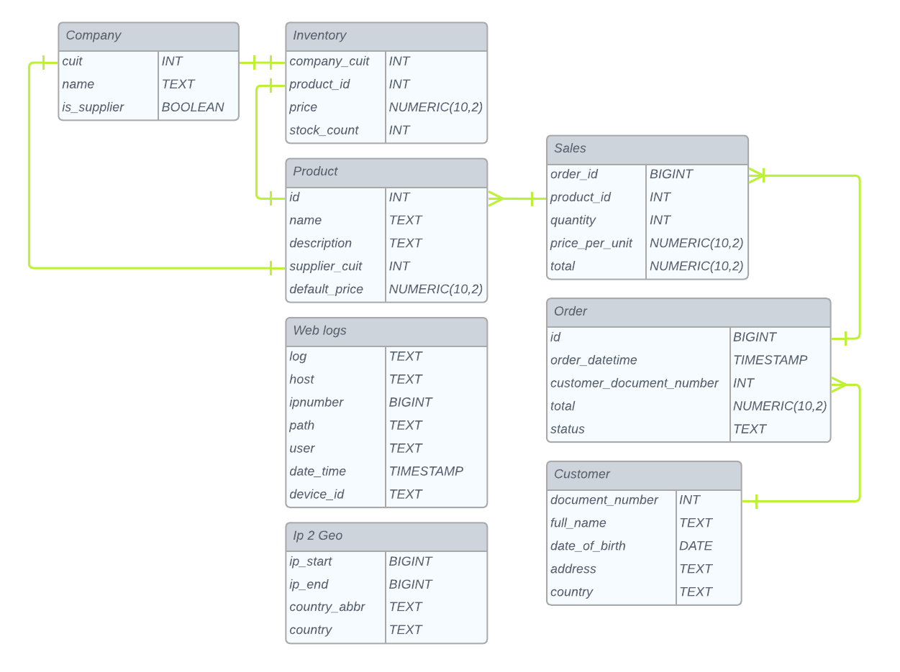
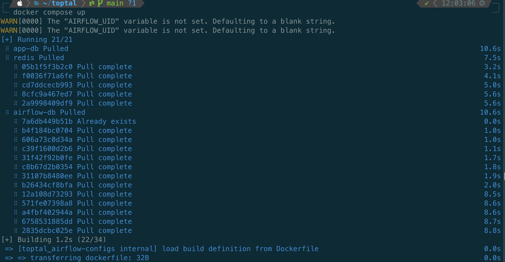
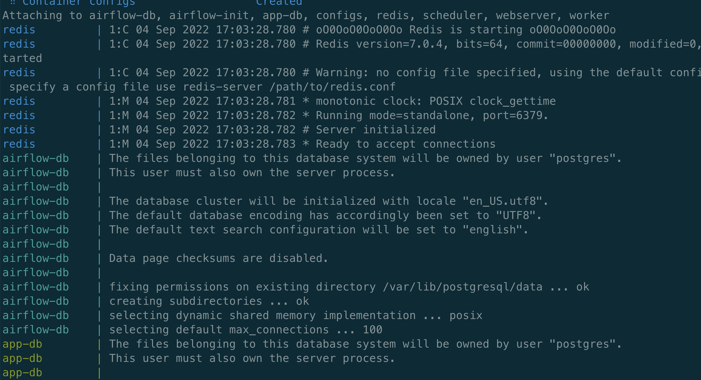
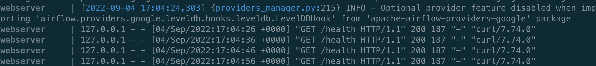
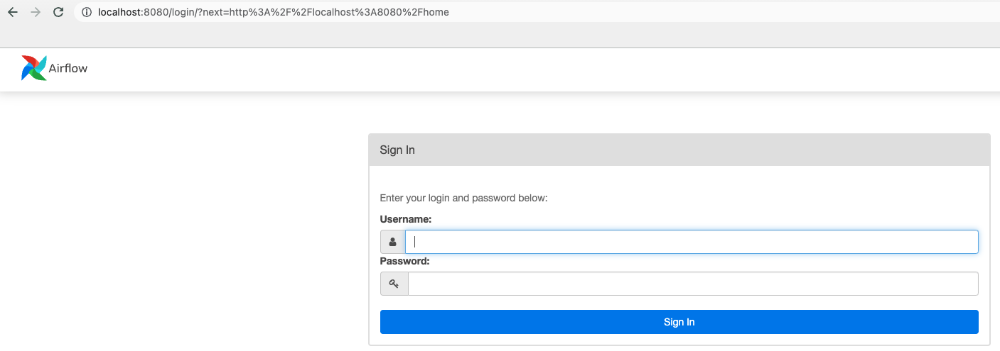
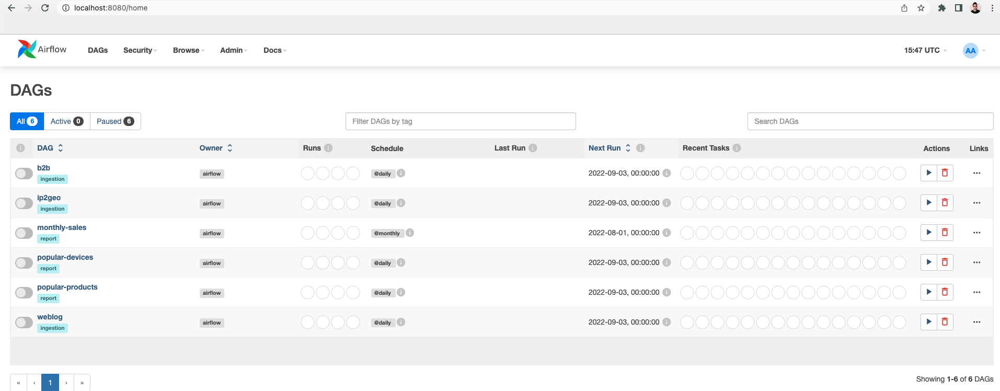
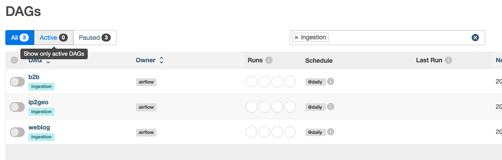
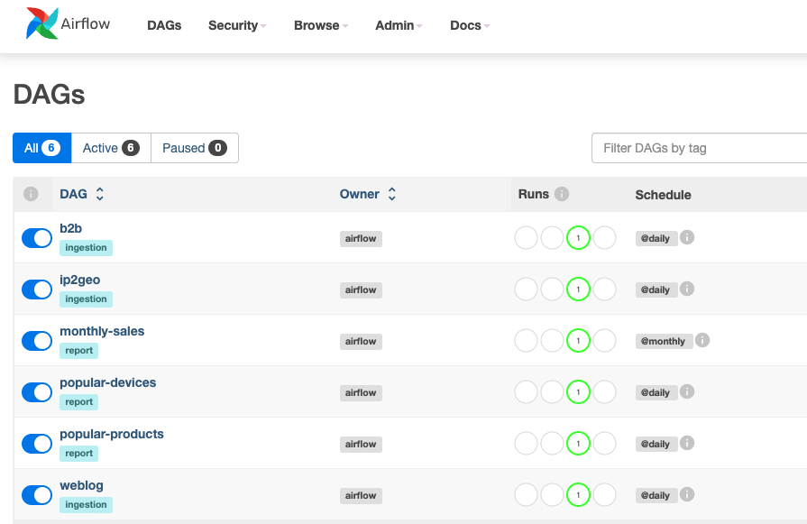
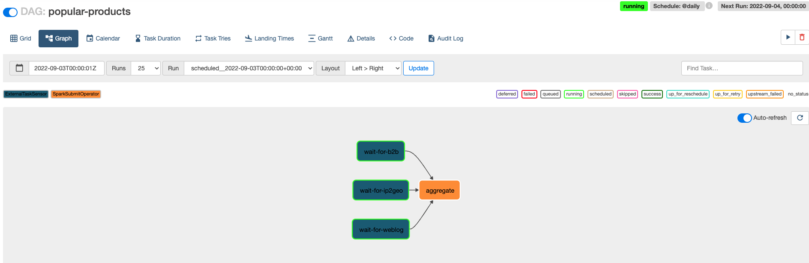

# SQL ETL Challenge - Aldo Orozco

> Proof of concept of a SQL ETL system, corresponding to the Toptal challenge.

## Table of Content

<details>
  <summary>Table Of Content</summary>

- [Prerequisites](#prerequisites)
- [Project Structure](#project-structure)
- [Components](#components)
- [Data sources](#data-sources)
- [Spin up environment](#spin-up-environment)
- [Workflow breakdown](#workflow-breakdown)
- [Scripts](#scripts)
- [Limitations](#limitations)
- [Future work](#future-work)
- [Contact](#contact)

</details>


## Prerequisites

This project uses Docker Compose for maximum isolation and reproducibility. **If you're running this on a OS other than MacOS**, refer to [these instructions](https://docs.docker.com/compose/install/compose-desktop/) to install it. Otherwise, keep on reading for detailed instructions.

### 1. Brew

Brew is a package manager for MacOS. To install it, open up a terminal and run:

```bash
/bin/bash -c "$(curl -fsSL https://raw.githubusercontent.com/Homebrew/install/HEAD/install.sh)"
```

### 2. Docker Compose

```bash
brew install docker-compose
```

### 3. Postgres (Optional)

This application stores models (datalake) and reports (datamart) in a Postgres database. The `app-db` exposes port `5432` so you can query away through `psql`. To install it, run:

```bash
brew install postgresql
```

## Project Structure

```
(f) Dockerfile       - The image used by Airflow components. Based on the official airflow image.
(d) apache-logs      - Generated folder where the weblogs are generated.
(d) config           - Airflow configurations. Currently hosting only the spark connection.
(d) dags             - Airflow DAGs. Divided in 2 folders: datalake (Ingestions) and datamart (Reports).
(f) docker-compose.yaml - Services' configuration, including mounts and environment variables.
(d) docs             - Project documentation. Currently hosting only images.
(d) etls             - Pyspark ETL/ELT pipelines.
(f) local.env        - Environment variables to configure services.
(d) reports          - Generated folder where reports are located. Paritioned by the workflow execution date.
(f) requirements.txt - Set of additional python packages to bake into the image.
(d) scripts          - Scripts to create tables, generate weblog traces and orders for the B2B platform.
(d) sources          - Data sources for ingestion,
```

## Components

The solution is underpinned by the following services:

| Component   | Description       |
| :---        | :---              |
| [Apache Airflow](https://airflow.apache.org/) | Workflow orchestration |
| [Apache Spark](https://spark.apache.org/)     | ELT/ETL pipelines      |
| [Postgres](https://www.postgresql.org/)       | Database for both the application and Airflow |
| [Celery](https://docs.celeryq.dev/en/stable/getting-started/introduction.html) | Task queue Airflow scheduler uses |
| [Redis](https://redis.io/)                    | Key-value store used as backend for Celery |

## Data Sources

The challenge description hints at entities to work with, but does not link to data sources. Therefore, most data sources are either manually created--`customer`, `company`--or generated through scripts--`orders`, `sales`, `weblog`.

List of sources:

| Source    | Located  | Generated |
| :---      | :---     | :---      |
| customer  | `sources/(data\|ddl)/customer.csv`  | Manually   |
| company   | `sources/(data\|ddl)/company.csv`   | Manually   |
| product   | `sources/(data\|ddl)/product.csv`   | Manually   |
| inventory | `sources/(data\|ddl)/inventory.csv` | Manually   |
| ip2geo    | `sources/(data\|ddl)/ip2geo.csv`    | [Downloaded](https://lite.ip2location.com/ip2location-lite) |
| order     | `sources/(data\|ddl)/order.csv`     | [Script](scripts/orders/create_orders.py), [DAG](dags/datalake/b2b.py) |
| sales     | `sources/(data\|ddl)/sales.csv`     | [Script](scripts/orders/create_orders.py), [DAG](dags/datalake/b2b.py) |
| weblog    | `apache-logs/access_log_{datetime}.log` | [Script](scripts/weblog/generate_traces.py), [DAG](dags/datalake/weblog.py) |

The corresponding ERD outlines the relationship between the data sources.



## Spin Up Environment

Run the following command from the top of the repo:

```bash
docker compose up -d
```

This will pull images from Dockerhub and create the corresponding containers.


**Figure 1** Initial image pull


**Figure 2** Service startup

First time running this should take 15 mins, depending on your internet connection and processor. Subsequent startups should take less than a minute.

Your environment should be ready upon seeing heartbeat checks.


**Figure 3** Webserver reporting heartbeats.

Now you can open up your favorite browser and type `localhost:8080` to access the Airflow webserver. You will be presented with the login page.


**Figure 4** Initial login

Enter `airflow` as both `Username` and `Password`, click `Sign In` and you will be redirected to the DAGs page.


**Figure 5** DAGs page

DAGs are divided in two: `ingestion` and `report`. You can filter using the text box to only see ingestion, for example.


**Figure 6** Ingestion DAGs filter

By default all DAGs are paused. Click on the toggle left hand side of each DAG to enable them. They will start up immediately


**Figure 7** DAGs running

Finally, to stop the application, execute:

```bash
docker compose up -d
```

## Workflow breakdown

The system encompasses 6 DAGs:

| DAG       | Category    |  Description  |
| :---      | :---        | :---          |
| b2b       | Ingestion   | Creates and populates b2b tables using the DDLs and CSVs. Generates orders as an intermediate step |
| ip2geo    | Ingestion   | Creates and populates the ip2geo table using the DDL and the downloaded CSV |
| weblog    | Ingestion   | Generates traces in combined log format, and loads them into the datalake |
| monthly-sales    | Report | All sales of B2B platform displayed monthly for the last year |
| popular-devices  | Report | Most popular used devices for B2B clients (top 5) |
| popular-products | Report | Most popular products in the country from which most users log into |

All workflows are configured to wait for their upstream dependencies using an external task sensor. For example:



Once upstream DAGs succeed, the report generation etl will start.

`Ingestion` DAGs load data to the datalake (emulated by `app-db`), and `Report` ones aggregate those data, producing the desired report in both CSV, under `reports/<name_of_the_report>/date=<execution_date>/report.csv`, and a table on the datamart (again, emulated by `app-db`).

## Scripts

The following table outlines the scripts this solution uses.

| Script           | Description  |  Arguments |
| :---             | :---         | :---       |
| [create_orders.py](scripts/orders/create_orders.py) | Generates N orders and sales and stores the result in the corresponding CSV files | `-o ORDERS` |
| [seed_db.py](scripts/seed-db/seed_db.py) | Creates tables using the DDLs | `-m MODELS` |
| [generate_traces.py](scripts/weblog/generate_traces.py) | Generates N entries on a single logfile using the combined format | `-n NUM_RECORDS` |

## Limitations

This project is by no means production ready, given the short period to complete it. Some key limitations of the solution are:

* Lack of (big) real-world data.
* Data in CSV format for human readability. Binary formats help improve performance (e.g., Avro, Parquet)
* Single point of failure, as the whole system is running on containers on the host.
* Although ETLs and DAGs use highly-scalable tools, they are not as performant, given the 1 container limitation.

## Future work

This solution is configured to easily swap local services with their equivalent on the cloud to scale as much as the data requires, with almost no changes. The major steps to productionize this solution are:

* Use a Cloud Provider (e.g., [GCP](https://cloud.google.com/), [AWS](https://aws.amazon.com/)).
    * Managed SQL instances for the ORM.
    * Datawarehouse to store aggregations and report data.
    * Apache Airflow either on Kubernetes or managed service (e.g., Composer, MWAA).
    * Apache Spark either on Kubernetes or managed service (e.g., Dataproc, EMR).
* Robust data quality checks using [Great Expectations Airflow](https://greatexpectations.io/blog/airflow-operator/).
* Weblog streaming ingestion either through Spark Streaming or [Apache Kafka](https://kafka.apache.org/).

## Contact

Aldo Orozco - aldo.orozco.g@gmail.com
